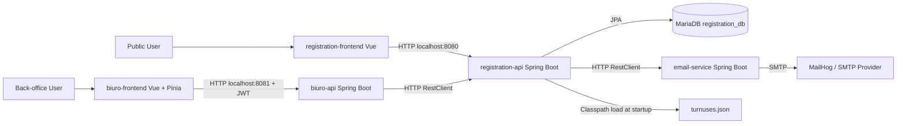
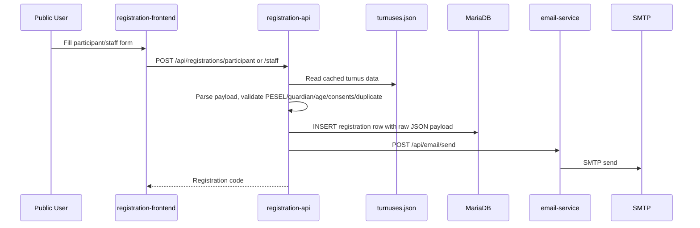
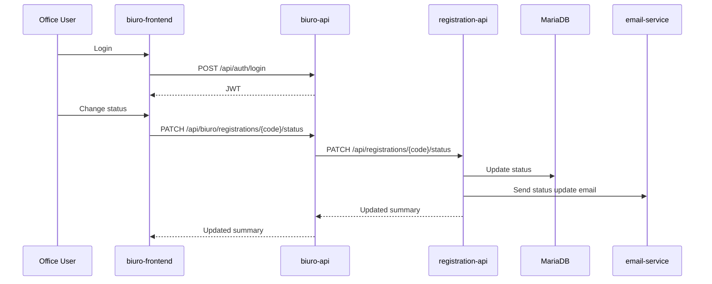
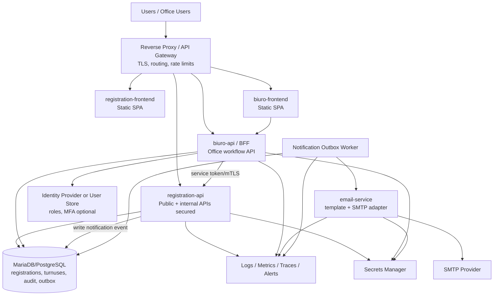
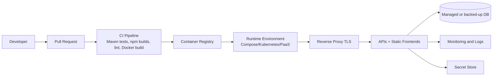
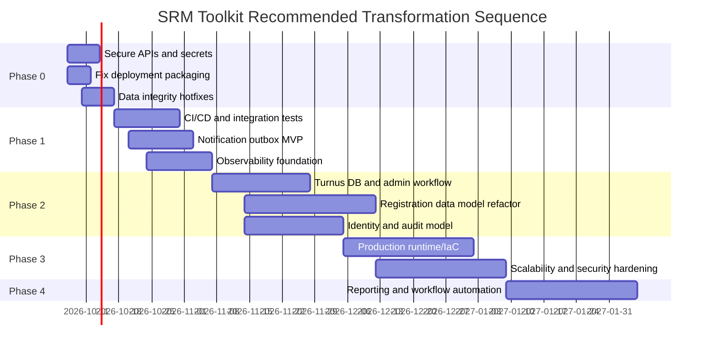

# SRM Toolkit Solution Architecture Assessment

Date: 2026-10-06  
Repository: `/home/osboxes/Documents/SRM-toolkit`  
Assessment scope: source code, repository structure, configuration, Docker files, scripts, tests, frontend clients, database migration, and the referenced `backend/registration-api/src/main/resources/data/turnuses.json`.

## Table of Contents

1. [Executive Summary](#1-executive-summary)
2. [Current-State Architecture](#2-current-state-architecture)
3. [Existing Features and Capabilities](#3-existing-features-and-capabilities)
4. [Issues, Bugs, and Gaps](#4-issues-bugs-and-gaps)
5. [Non-Functional Assessment](#5-non-functional-assessment)
6. [Technical Debt Analysis](#6-technical-debt-analysis)
7. [Target-State Architecture](#7-target-state-architecture)
8. [Current-State vs Target-State Gap Analysis](#8-current-state-vs-target-state-gap-analysis)
9. [Detailed Architecture Roadmap](#9-detailed-architecture-roadmap)
10. [Prioritized Recommendations](#10-prioritized-recommendations)
11. [Architecture Decision Considerations](#11-architecture-decision-considerations)
12. [Assumptions and Missing Information](#12-assumptions-and-missing-information)
13. [Final Architecture Assessment](#13-final-architecture-assessment)

## 1. Executive Summary

The SRM Toolkit is a small multi-application registration platform for retreat or camp turnus registration. It consists of:

- `registration-api`: Spring Boot service for public participant/staff registration, turnus lookup, registration persistence, status management, and email notification orchestration.
- `biuro-api`: Spring Boot back-office API with local username/password login, JWT issuance, registration listing/filtering, detail retrieval, status changes, and turnus statistics.
- `email-service`: Spring Boot service for rendering Thymeleaf email templates and sending email through SMTP.
- `registration-frontend`: Vue 3/Vite public registration frontend.
- `biuro-frontend`: Vue 3/Vite/Pinia back-office frontend.
- MariaDB, MailHog, and Docker Compose configuration.

### Current State Summary

The application has a coherent MVP shape and a useful separation between public registration, back-office operations, and email delivery. Backend unit tests pass and both frontend builds complete successfully. The codebase also shows concrete security, deployment, reliability, data consistency, and maintainability risks that should be addressed before production use.

### Major Strengths

| Strength | Evidence |
|---|---|
| Clear module boundaries for registration, office, and email concerns | Maven modules in `pom.xml`; service directories under `backend/*`; frontends under `frontend/*` |
| Database schema is migration-managed | Flyway enabled in `backend/registration-api/src/main/resources/application.yml:13-15`; migration in `backend/registration-api/src/main/resources/db/migration/V1__init.sql` |
| Basic automated test coverage exists for core backend services | `bash ./mvnw test` passed: 25 backend tests, 0 failures |
| Frontend builds are currently healthy | `npm run build` passed for both `frontend/registration-frontend` and `frontend/biuro-frontend` |
| Registration validation exists for PESEL, guardian data, consents, age, and duplicates | `RegistrationValidationService` |
| Email templating is separated into an email service | `backend/email-service/src/main/java/pl/srm/emailservice/email/*` |

### Major Weaknesses and Risks

| Risk | Severity | Evidence |
|---|---:|---|
| Public `registration-api` exposes management endpoints without service-level authentication | Critical | `RegistrationController` exposes `GET /api/registrations`, `GET /api/registrations/{code}`, and `PATCH /api/registrations/{code}/status` in `backend/registration-api/src/main/java/pl/srm/registrationapi/registration/controller/RegistrationController.java:50-63`; no Spring Security config exists in `registration-api` |
| Secrets and admin defaults are tracked | Critical | `.env` is tracked by `git ls-files`; contains `BIURO_PASSWORD=biuro123` and default `JWT_SECRET`; duplicate defaults in `backend/biuro-api/src/main/resources/application.yml:6-9` |
| Docker Compose paths do not match repository layout | High | `docker-compose.yml:31`, `:52`, `:73`, and `:94` reference paths that do not exist from the root layout |
| Registration code generation is race-prone | High | `countByTurnusCode() + 1` in `RegistrationPersistenceService.java:39-40` |
| Email failure is swallowed and not retried | High | `EmailServiceClient.java:41-53`; backend tests also validate swallowed SMTP failures |
| Turnus capacity is inconsistent | Medium | `turnuses.json:13` and `:27` say capacity 60; `RegistrationStatisticsService.java:13` hard-codes 50 |
| Payload stores sensitive personal and health data as raw JSON `LONGTEXT` | High | `Registration.java:42-43`; migration `V1__init.sql:10` |
| Frontend API base URLs are hard-coded to localhost | Medium | `frontend/registration-frontend/src/api/registrationApi.js:1`; `frontend/biuro-frontend/src/api/registrationApi.js:15,27,41,53` |

### Top Architectural Priorities

1. Protect `registration-api` management endpoints and service-to-service calls.
2. Remove tracked secrets and require production-grade secret injection.
3. Repair Docker/Compose packaging so the system can be deployed repeatably.
4. Make registration code generation concurrency-safe and add a database uniqueness rule for duplicate registrations.
5. Replace best-effort email calls with reliable asynchronous notification delivery.
6. Move turnus, capacity, registration periods, and business rules into a governed data model.
7. Improve observability, CI/CD, integration tests, and operational runbooks.

## 2. Current-State Architecture

### Repository Structure

```text
SRM-toolkit
├── backend
│   ├── registration-api
│   ├── biuro-api
│   └── email-service
├── frontend
│   ├── registration-frontend
│   └── biuro-frontend
├── docker-compose.yml
├── scripts
│   ├── build.sh
│   └── run-local.sh
├── .env
├── pom.xml
└── README.md
```

### Technologies and Frameworks

| Area | Current Technology | Evidence |
|---|---|---|
| Backend framework | Spring Boot 4.0.6, Java 21 | Root `pom.xml`; module POMs |
| Persistence | Spring Data JPA, MariaDB JDBC, Flyway | `backend/registration-api/pom.xml`; `application.yml` |
| Database | MariaDB 11 | `docker-compose.yml:7` |
| Frontend | Vue 3, Vite, Tailwind CSS | `frontend/*/package.json` |
| Back-office state | Pinia | `frontend/biuro-frontend/package.json` |
| Email | Spring Mail, Thymeleaf templates, SMTP | `backend/email-service/pom.xml`; `EmailDispatchService` |
| Auth | Custom local username/password plus JWT in `biuro-api` | `AuthService`, `JwtConfig`, `SecurityConfig` |
| Deployment | Dockerfiles and Docker Compose, partially broken | `docker-compose.yml`; `backend/*/Dockerfile` |
| Observability | Spring Actuator in `registration-api` only | `registration-api/application.yml:17-24` |
| CI/CD | No CI configuration found | `.github`, `.gitlab`, `.circleci` absent |

### Current-State Architecture Diagram



### Major Components and Interactions

#### `registration-api`

Responsibilities:

- Public participant registration: `POST /api/registrations/participant`.
- Public staff registration: `POST /api/registrations/staff`.
- Registration detail/list/status management: `GET /api/registrations`, `GET /api/registrations/{code}`, `PATCH /api/registrations/{code}/status`.
- Turnus listing: `GET /api/turnuses` and `GET /api/turnusy`.
- Validation, persistence, duplicate detection, notification orchestration.
- Database access through Spring Data JPA.

Evidence:

- Controller endpoints: `backend/registration-api/src/main/java/pl/srm/registrationapi/registration/controller/RegistrationController.java:38-73`.
- Turnus endpoints: `backend/registration-api/src/main/java/pl/srm/registrationapi/turnus/controller/TurnusController.java`.
- Entity and schema: `Registration.java:21-49`, `V1__init.sql:1-16`.
- Email client: `EmailServiceClient.java:19-53`.

#### `biuro-api`

Responsibilities:

- Back-office login.
- JWT validation for `/api/**`.
- Registration listing/filtering, details, status changes.
- Turnus statistics aggregation.
- Proxying calls to `registration-api`.

Evidence:

- Security boundary: `backend/biuro-api/src/main/java/pl/srm/biuroapi/auth/config/SecurityConfig.java`.
- Login implementation: `backend/biuro-api/src/main/java/pl/srm/biuroapi/auth/service/AuthService.java`.
- Registration API client: `RegistrationApiClient.java:31-80`.
- Stats logic: `RegistrationStatisticsService.java:13-75`.

#### `email-service`

Responsibilities:

- Accept email send requests.
- Validate required request fields.
- Render templates.
- Send SMTP messages.

Evidence:

- `EmailController`.
- `EmailDispatchService`.
- `TemplateRenderer`.
- `SmtpEmailSender`.

#### Frontends

`registration-frontend`:

- Routes: `/`, `/kadra`, `/uczestnik`.
- Builds participant and staff payloads and submits to `registration-api`.
- Fetches available turnusy.

`biuro-frontend`:

- Routes: `/login`, `/dashboard`.
- Stores JWT in local storage.
- Calls `biuro-api` for registrations, status updates, details, stats.

Evidence:

- Public API client hard-codes `http://localhost:8080`: `frontend/registration-frontend/src/api/registrationApi.js:1`.
- Back-office API client hard-codes `http://localhost:8081`: `frontend/biuro-frontend/src/api/registrationApi.js:15,27,41,53`.
- Token persistence: `frontend/biuro-frontend/src/stores/auth.js:3-19`.

### Data Flows

#### Registration Submission Flow



#### Back-office Status Update Flow



### Current Architectural Patterns

| Pattern | Current Use | Assessment |
|---|---|---|
| Layered Spring services | Controllers, services, repositories are separated | Useful, mostly clear |
| Microservice-style decomposition | Registration, office, email split into services | Premature for current operational maturity; adds HTTP failure modes |
| Database migration | Flyway used | Good foundation |
| Proxy/BFF pattern | `biuro-api` proxies admin UI to `registration-api` | Useful intent, but underlying API remains exposed |
| Static reference data | `turnuses.json` loaded at startup | Simple MVP pattern, weak operational flexibility |
| Raw payload storage | Full registration JSON stored in `LONGTEXT` | Flexible but high privacy and queryability risk |

### Anti-Patterns and Unnecessary Complexity

| Anti-pattern | Evidence | Impact |
|---|---|---|
| Security by proxy | `biuro-api` secures admin endpoints, but `registration-api` exposes same management operations directly | Unauthorized data access and status changes if `registration-api` is reachable |
| Synchronous service chain with swallowed failures | Registration calls email over HTTP; email failures logged and ignored | Users may not receive confirmations; no retry or audit |
| Count-based identifier generation | `RegistrationPersistenceService.java:39-40` | Race conditions under concurrent submissions |
| Hard-coded environment | Frontends call `localhost`; CORS only localhost | Deployments outside local dev require rebuild/code edits |
| Static capacity duplicated outside source data | `turnuses.json` capacity 60 vs back-office constant 50 | Incorrect availability reporting |
| Broken deployment config | Docker Compose and Dockerfiles disagree on paths | Container deployment likely fails |
| Local GUI run script | `scripts/run-local.sh` uses `gnome-terminal` | Not portable for servers/CI/headless environments |

## 3. Existing Features and Capabilities

### Feature Inventory

| Feature | Purpose | Business Value | Main Components | Dependencies | Status | Known Limitations |
|---|---|---|---|---|---|---|
| Public participant registration | Submit participant application | Core intake capability | `registration-frontend`, `registration-api`, MariaDB, `email-service` | Turnus data, PESEL validation, SMTP | Implemented | Raw JSON request body; no rate limiting; email not guaranteed; hard-coded API URL |
| Public staff registration | Submit staff/kadra application | Staff recruitment/intake | `registration-frontend`, `registration-api`, MariaDB, `email-service` | Staff role config, SMTP | Implemented | Similar to participant; staff-specific validation depth requires validation |
| Turnus listing | Show available registration periods | Lets users choose valid turnus | `TurnusController`, `StubTurnusProvider`, `turnuses.json` | JSON resource | Implemented | Static startup data; requires redeploy for changes; no admin management |
| Registration validation | Enforce PESEL, age, consents, duplicate, guardian rules | Reduces invalid applications | `RegistrationValidationService`, `PeselHelper`, `TurnusValidator` | Turnus data, DB lookup | Implemented | Duplicate prevention lacks DB unique constraint for `(turnus_code, pesel_hash)` |
| Registration persistence | Store submission and code | System of record for applications | `RegistrationPersistenceService`, `RegistrationRepository`, MariaDB | Flyway schema | Implemented | Race-prone code sequence; sensitive raw payload not encrypted |
| Registration confirmation email | Notify applicant/guardian after submission | User confidence and audit trail | `RegistrationNotificationService`, `EmailServiceClient`, `email-service` | SMTP, templates | Implemented best-effort | Failure swallowed; no retries; no delivery status |
| Back-office login | Authenticate office user | Limits admin UI access | `biuro-api`, `biuro-frontend`, JWT | Configured credentials | Implemented | Single static credential; defaults tracked; no roles/MFA/password hashing |
| Back-office registration list/filter | Operational review queue | Office productivity | `biuro-frontend`, `biuro-api`, `registration-api` | Service-to-service HTTP | Implemented | Fetch-all then in-memory filter; no pagination; underlying API unsecured |
| Registration detail view | Review full submission | Supports decision-making | `RegistrationDetailModal`, `RegistrationManagementService` | Raw payload | Implemented | Exposes full sensitive payload; no field-level authorization or audit |
| Status update | Accept, reject, waitlist | Core workflow | `biuro-frontend`, `biuro-api`, `registration-api`, email | JWT to `biuro-api`, SMTP | Implemented | `registration-api` status endpoint unsecured; no transition model; no audit actor |
| Status update email | Notify user of decision | Communication | `StatusNotificationService`, `email-service` | Payload email fields, SMTP | Implemented best-effort | No retry, no status history, no delivery evidence |
| Turnus statistics | Show occupied/available counts by gender/status | Capacity planning | `RegistrationStatisticsService` | Registration summaries | Partially implemented | Uses hard-coded capacity 50 instead of turnus capacity 60; no DB aggregation |
| Email templating | Render business emails | Branded communication | Thymeleaf templates | Template variables | Implemented | Template catalog not externally managed; no preview or localization workflow |
| Local build scripts | Developer convenience | Onboarding | `scripts/build.sh`, `scripts/run-local.sh` | Maven, Node, GUI terminal | Implemented | Not CI-grade; GUI-specific; uses `npm install` instead of `npm ci` |
| Docker Compose stack | Local/prod-like orchestration | Deployment convenience | `docker-compose.yml`, Dockerfiles | Docker | Broken / incomplete | Incorrect paths and missing registration frontend service |

### Incomplete Features

| Feature | Evidence | Status |
|---|---|---|
| Production deployment | Compose paths are invalid; no CI/CD; no reverse proxy or TLS | Requires remediation |
| Registration frontend in Compose | `docker-compose.yml` only defines `biuro-frontend`, not `registration-frontend` | Missing |
| Secure admin API boundary | Management operations exist on public service without security | Incomplete |
| Reliable notifications | Email calls are best-effort, synchronous, and swallowed on failure | Incomplete |
| Turnus administration | Turnuses are static JSON | Missing |
| Audit trail | No table or code for status history/actor/change reason beyond current rejection reason | Missing |
| Monitoring and alerting | Actuator partial; no metrics backend or alerts | Missing |
| Backup and disaster recovery | No backup scripts or restore runbooks found | Missing information / likely missing |

### Duplicated or Inconsistent Functionality

| Area | Evidence | Assessment |
|---|---|---|
| API URLs | Multiple hard-coded localhost constants in frontend clients | Inconsistent configuration approach |
| Capacity | `turnuses.json` uses 60; `RegistrationStatisticsService` uses 50 | Confirmed data inconsistency |
| Registration management access | Same operations available via `biuro-api` and directly via `registration-api` | Duplicated exposure with inconsistent security |
| Build layout assumptions | Dockerfiles assume module path `registration-api`; repo uses `backend/registration-api` | Inconsistent packaging assumptions |

### Obsolete Functionality

No confirmed obsolete business functionality was identified. `StatusUpdateRequest`, `Person`, and `RegistrationValidationRequest` should be reviewed for actual API use because controller methods receive raw `String` payloads for registration submissions.

Status: Requires Validation.

### Missing Capabilities

- Central authentication and authorization model.
- Service-to-service authentication.
- Rate limiting and abuse prevention.
- Structured registration schema with encrypted sensitive fields.
- Admin audit history.
- Transactional outbox or message queue for notifications.
- Turnus/capacity management UI and database model.
- CI/CD pipeline.
- Infrastructure-as-Code for production.
- Centralized logs, metrics, traces, dashboards, and alerts.
- Backup/restore automation.
- API contract documentation/OpenAPI.
- Pagination/search/export for back-office operations.
- Privacy/data retention workflow.

## 4. Issues, Bugs, and Gaps

### Risk Register

| Issue | Evidence | Root Cause | Impact | Severity | Recommendation | Priority | Classification |
|---|---|---|---|---|---|---|---|
| `registration-api` management endpoints are unauthenticated | `RegistrationController.java:50-63` exposes detail/list/status endpoints; no `registration-api` security config found | Admin and public APIs are mixed in one controller/service boundary | Unauthorized read of all registrations and status mutation if service is reachable | Critical | Add Spring Security to `registration-api`; separate public submission endpoints from internal/admin endpoints; require service token or move management behind `biuro-api` only | Immediate | Confirmed issue |
| Tracked `.env` contains default credentials and JWT secret | `git ls-files .env`; `.env` contains `BIURO_PASSWORD=biuro123`, default `JWT_SECRET`; defaults repeated in `biuro-api/application.yml:6-9` | Secrets committed for local convenience | Credential leakage, trivial admin compromise | Critical | Remove `.env` from Git history, rotate all secrets, commit `.env.example`, fail startup when production secrets are defaults | Immediate | Confirmed issue |
| Docker Compose backend Dockerfile paths are wrong | `docker-compose.yml:31`, `:52`, `:73` reference `registration-api/Dockerfile`, `biuro-api/Dockerfile`, `email-service/Dockerfile`; actual files are under `backend/*` | Packaging layout changed without Compose update | Container build fails | High | Update contexts/dockerfile paths and Dockerfile module paths; validate with `docker compose build` | Immediate | Confirmed issue |
| Docker Compose frontend path is wrong and public frontend is missing | `docker-compose.yml:94` uses `biuro-frontend`; actual path is `frontend/biuro-frontend`; no `registration-frontend` service | Compose file not aligned with repository | Incomplete deployable stack | High | Add both frontend services or route through one reverse proxy; fix build contexts | Immediate | Confirmed issue |
| Backend Dockerfiles assume wrong module paths | `backend/registration-api/Dockerfile:4` uses `./mvnw -pl registration-api`; actual Maven module is `backend/registration-api`; `:8` copies `/workspace/registration-api/target` | Dockerfiles written for a different folder layout | Image builds likely fail even if Compose paths are fixed naively | High | Build from repository root using `./mvnw -pl backend/registration-api -am package`; copy `backend/registration-api/target/*.jar` | Immediate | Confirmed issue |
| Root Maven wrapper is not executable | `./mvnw test` failed with `Brak dostępu`; `bash ./mvnw test` succeeded | File mode not executable | Developer/CI scripts using `./mvnw` fail | Medium | Set executable bit and enforce in Git | Short-term | Confirmed issue |
| Race-prone registration code generation | `RegistrationPersistenceService.java:39-40` uses count + 1 | Identifier sequence is derived from mutable aggregate count | Concurrent registrations can generate duplicate registration codes and fail or confuse users | High | Use DB sequence/table, auto-increment derived code after insert, pessimistic/optimistic locking, or retry on unique conflict | Immediate | Architectural risk / confirmed code pattern |
| Duplicate registration prevention is not enforced at database level | Migration has separate indexes only: `V1__init.sql:13-15`; validation checks `existsByTurnusCodeAndPeselHash` | Application-only uniqueness | Race condition allows duplicate logical registrations under concurrency | High | Add unique constraint on `(turnus_code, pesel_hash)` and handle duplicate-key response | Immediate | Architectural risk |
| Email failures are swallowed | `EmailServiceClient.java:41-53`; `SmtpEmailSenderTest` validates swallowed SMTP failure | Best-effort synchronous notification design | Lost confirmations/status emails with no retry or operational queue | High | Add transactional outbox table and worker; persist notification status and retry attempts | Short-term | Confirmed issue |
| Back-office API returns empty list on registration-api failure | `RegistrationApiClient.java:31-42` logs and returns `List.of()` | Failure is converted to valid empty state | Operators may believe no registrations exist during outage | High | Return 502/503 and show degraded state in UI; add health check | Short-term | Confirmed issue |
| Turnus capacity inconsistent | `turnuses.json:13` and `:27` use 60; `RegistrationStatisticsService.java:13` uses 50 | Capacity duplicated in code | Incorrect availability reporting and office decisions | Medium | Source capacity from turnus model/API or DB | Immediate | Confirmed issue |
| Sensitive payload stored as raw `LONGTEXT` | `Registration.java:42-43`; `V1__init.sql:10` | Flexible raw payload storage | Personal, health, and guardian data are hard to secure, query, validate, retain, or redact | High | Normalize key fields; encrypt sensitive JSON/columns; add retention and access controls | Medium-term | Architectural risk |
| No service-to-service authentication | `biuro-api` calls `registration-api` via plain URL; `registration-api` calls `email-service` via plain URL | Trusted network assumption | Internal endpoints can be called directly by any network actor | High | Add mTLS or signed service tokens; restrict network exposure | Short-term | Confirmed architectural risk |
| Actuator exposes `env` and health details | `registration-api/application.yml:17-24` includes `env` and `show-details: always` | Development observability config applied broadly | Environment and dependency details may leak | High | Restrict actuator endpoints, disable `env`, show details only when authorized | Immediate | Confirmed issue |
| Static local CORS configuration | `CorsConfig.java:17-22`; `SecurityConfig.java:46` | Dev-only origins coded in backend | Production frontends blocked or insecurely patched later | Medium | Externalize allowed origins per environment | Short-term | Confirmed issue |
| Frontend API URLs hard-coded to localhost | `registrationApi.js:1`, `biuro registrationApi.js:15,27,41,53`, `authApi.js` | No runtime frontend config | Production builds require code changes | Medium | Use Vite env variables or injected runtime config | Short-term | Confirmed issue |
| JWT stored in localStorage | `auth.js:3-19` | SPA convenience auth storage | XSS can exfiltrate admin token | Medium | Prefer secure HttpOnly same-site cookies or strong CSP plus short-lived tokens | Medium-term | Architectural risk |
| Single static admin account | `AuthService.java`; `biuro-api/application.yml:6-7` | No user store or identity provider | No per-user accountability, revocation, roles, MFA, password lifecycle | High | Introduce user identities/roles or external IdP | Medium-term | Confirmed limitation |
| No audit trail for status changes | Only current `status`, `rejection_reason`, `updated_at` exist in `V1__init.sql` | No audit model | Cannot answer who changed what/when/why | High | Add `registration_status_history` with actor, source, reason, timestamp | Short-term | Missing capability |
| No pagination on registration list | `RegistrationManagementService.getAll()` maps all rows; `biuro-api` filters in memory | MVP implementation | Performance degradation as registrations grow | Medium | Add paged/filtering query API in `registration-api` and UI pagination | Medium-term | Confirmed issue |
| No CI pipeline found | `.github`, `.gitlab`, `.circleci` absent | Build/test process is local/manual | Regressions can merge unnoticed | High | Add CI for Maven tests, npm builds, Docker build, static checks | Short-term | Confirmed gap |
| No IaC or production topology | No Terraform/Kubernetes/cloud config found | Local Docker Compose only | Environment drift and manual deployment risk | Medium | Define environment-specific deployment architecture and IaC | Medium-term | Missing information / gap |
| No backup/restore evidence | No scripts or docs found | Operational maturity gap | Data loss risk | High | Define MariaDB backup, restore test, RPO/RTO | Short-term | Missing information |
| Minimal documentation | Root `README.md` only contains title | Documentation not maintained | Onboarding and operations risk | Medium | Add architecture, local dev, deployment, API, recovery docs | Short-term | Confirmed issue |
| Test gaps for integration and security | Existing tests are unit/controller tests; no Testcontainers/E2E/security tests found | MVP test strategy | Security and deployment issues not caught | High | Add integration tests with MariaDB, auth, Docker build, frontend E2E smoke | Short-term | Confirmed gap |
| Mockito dynamic agent warnings | Maven test output warns dynamic agent loading will be disallowed in future JDK | Test runtime not future-proofed | Future JDK upgrades may break tests | Low | Configure Mockito agent per documentation | Long-term | Confirmed issue |
| Build artifacts and local generated files present in working tree | `find` showed `target`, `dist`, `node_modules`, `.idea`; `.gitignore` excludes them | Local workspace hygiene issue | Slower scans, accidental commits risk | Low | Clean workspace; ensure ignored files are not tracked | Short-term | Confirmed local state |

## 5. Non-Functional Assessment

| Area | Current State | Identified Problems | Risk Level | Recommended Improvements |
|---|---|---|---|---|
| Performance | Small services; in-memory filtering; frontend bundles build successfully | Fetch-all registration list; payload parsing per row; no pagination; no DB-level aggregation | Medium | Add paginated/filterable API, DB indexes for query patterns, server-side stats aggregation |
| Scalability | Single MariaDB; stateless APIs except static JSON cache | Count-based sequence and duplicate check race; no horizontal-scaling-safe ID generation | High | DB-backed sequences/unique constraints; stateless config; externalize turnus data |
| Availability | Docker Compose restart policy; no production topology | Broken Compose; no load balancing; no health-based dependency checks except MariaDB | High | Fix Compose, add health checks for each service, define production deployment topology |
| Reliability | Unit tests pass; registration persists before email | Email failures swallowed; registration-api outage appears as empty list in `biuro-api` | High | Outbox/retries, propagate upstream errors, dashboard degraded states |
| Resilience | RestClient calls exist | No timeouts, retries, circuit breakers, or idempotency | High | Configure connect/read timeouts, retry policies for safe calls, idempotency keys |
| Security | `biuro-api` protects `/api/**` with JWT | `registration-api` management endpoints unsecured; secrets tracked; actuator env exposed | Critical | Secure all sensitive endpoints, rotate secrets, restrict actuator, add service auth |
| Authentication and authorization | Single static office credential; JWT HMAC | No roles, MFA, user audit, password hashing, session revocation | High | External IdP or user store with roles; per-user audit |
| Data protection | PESEL hash stored; raw payload stored | Full personal/health data stored raw; no encryption/retention policy evidence | High | Encrypt sensitive fields, retention policy, access logging, data minimization |
| Observability | Basic logs; Actuator on registration service | No centralized logs, metrics backend, tracing, dashboards, alerts | High | Structured logs with correlation IDs, Prometheus/Grafana, tracing, alerts |
| Logging | SLF4J logs in services | May log exceptions and request context without privacy policy; no correlation IDs | Medium | Add request IDs, sanitize PII, log operational events |
| Monitoring | Actuator endpoints configured on one service | No monitoring system or alerting | High | Add service health, JVM, DB, queue, SMTP, business metrics |
| Alerting | None found | Failures require manual discovery | High | Alert on service down, email backlog, DB errors, high 5xx, registration failures |
| Maintainability | Clear packages; tests exist | Raw JSON contracts; duplicated constants; static config; sparse docs | Medium | API contracts, typed DTOs, common config conventions, architecture docs |
| Testability | Unit tests pass | No integration tests with MariaDB/SMTP/HTTP chain; no frontend tests | Medium | Testcontainers, contract tests, Playwright smoke tests |
| CI/CD | No pipeline found | Manual build/test/deploy | High | Add CI pipeline and release workflow |
| Deployment | Dockerfiles/Compose exist | Paths are broken; no TLS/reverse proxy; missing public frontend | High | Repair Docker; add reverse proxy; environment-specific config |
| Infrastructure management | Docker Compose only | No IaC; no environment definitions | Medium | IaC for target platform, environment variables/secrets management |
| Data integrity | Unique registration code; indexes | No unique `(turnus_code,pesel_hash)`; race-prone code | High | Add constraints, migration, transaction/retry handling |
| Backup and DR | No evidence found | RPO/RTO unknown | High | Automated backups, restore drills, runbook |
| Cost efficiency | Lightweight stack | Microservice split may add operational cost for small scale | Medium | Keep deployment simple; consider modular monolith or managed services |
| Developer experience | Scripts and module layout exist | Wrapper not executable; docs sparse; GUI script not portable | Medium | Fix wrapper mode, improve README, compose profiles, Makefile/task runner |

## 6. Technical Debt Analysis

| Debt Area | Debt Item | Classification | Evidence | Consequence if Not Addressed |
|---|---|---|---|---|
| Application code | Public and admin registration operations mixed in `RegistrationController` | Critical | `RegistrationController.java:38-73` | Unauthorized access and fragile evolution |
| Security | Tracked `.env` and default credentials | Critical | `.env`; `biuro-api/application.yml:6-9` | Admin compromise and secret reuse exposure |
| Security | No service auth between backend services | High | `RegistrationApiClient`, `EmailServiceClient` plain HTTP | Lateral movement and direct internal API abuse |
| Architecture | Synchronous email dependency without reliability pattern | High | `EmailServiceClient.java:41-53` | Silent notification loss and poor user communication |
| Data model | Raw `LONGTEXT` registration payload | High | `Registration.java:42-43` | Difficult privacy controls, query/reporting limits, schema drift |
| Data integrity | Application-only duplicate detection | High | `RegistrationRepository.existsByTurnusCodeAndPeselHash`; no DB unique constraint | Duplicate registrations under load |
| APIs | No OpenAPI/contract documentation | Medium | No API docs found | Frontend/backend drift and onboarding friction |
| Integrations | RestClient has no timeout policy | High | `RestClientConfig.java:10-12` in both services | Hanging requests and thread exhaustion |
| Infrastructure | Broken Docker build configuration | High | `docker-compose.yml`; Dockerfiles | Deployment failure |
| Testing | No integration/E2E/security tests | High | Existing test inventory limited to backend unit/controller tests | Critical deployment/security gaps persist |
| Deployment | CI/CD absent | High | No CI config found | Manual, error-prone releases |
| Documentation | Root README lacks architecture/setup details | Medium | `README.md` contains only `# SRM-toolkit` | Poor onboarding and ops readiness |
| Dependencies | Spring Boot 4.0.6 and Vite 8 are recent/possibly ecosystem-sensitive | Medium | POM/package files | Requires active compatibility testing and dependency monitoring |
| Repository hygiene | `.env` tracked despite `.gitignore`; local generated artifacts present | Medium | `git ls-files .env`; file listing | Accidental exposure and noisy workspace |

## 7. Target-State Architecture

### Core Architectural Principles

1. Public surfaces and administrative surfaces must be explicitly separated and secured.
2. Sensitive data must be minimized, encrypted where appropriate, and audited on access/change.
3. Business-critical workflows must be reliable and observable.
4. Configuration must be environment-driven, not hard-coded in source.
5. Deployment must be reproducible through CI/CD and validated container builds.
6. Database constraints must enforce core invariants.
7. Keep operational complexity proportionate to the product scale.

### Recommended Target Architecture



### Target Components

| Component | Target Role |
|---|---|
| Reverse proxy/API gateway | TLS termination, routing, CORS, rate limiting, security headers |
| `registration-frontend` | Public SPA with runtime-configured API base |
| `biuro-frontend` | Office SPA using secure session/token handling |
| `registration-api` | Public submission API plus secured internal registration domain API |
| `biuro-api` | Back-office BFF with user identity, authorization, filtering, workflow actions |
| Database | Registrations, normalized key fields, turnuses, audit history, notification outbox |
| Notification worker | Reliable async email delivery from outbox |
| `email-service` | SMTP adapter and template renderer; possibly merge if operational scale is small |
| Observability stack | Structured logs, metrics, traces, dashboards, alerts |
| Secret management | Runtime secrets injected from environment/secret store; no tracked real secrets |

### Component Classification

| Component | Classification | Rationale |
|---|---|---|
| `registration-api` | REFACTOR | Keep core domain logic, but secure endpoints, separate public/internal APIs, improve data model and reliability |
| `biuro-api` | REFACTOR | Keep BFF role, add robust auth, propagate upstream failures, add pagination/search |
| `email-service` | CONSOLIDATE or RETAIN | Retain if independent scaling/provider abstraction is needed; otherwise consolidate into worker/module to reduce ops burden |
| `registration-frontend` | REFACTOR | Keep UX, externalize API config, improve validation/error handling |
| `biuro-frontend` | REFACTOR | Keep workflow, improve token/session security, pagination, degraded states |
| MariaDB | RETAIN | Adequate for current scope if backups, constraints, and migrations are improved |
| `turnuses.json` | REPLACE | Move to database-managed turnus table and admin workflow |
| Docker Compose | REFACTOR | Repair paths, add profiles, include all services, add health checks |
| `.env` tracked secrets | REMOVE | Replace with `.env.example` and secret injection |
| CI/CD | INTRODUCE | Required for repeatable quality gates and deployment |
| Outbox/notification worker | INTRODUCE | Required for reliable email |
| Audit history | INTRODUCE | Required for back-office accountability |
| Central observability | INTRODUCE | Required for operations |

### Significant Architectural Changes

| Change | Why Required | Expected Benefit | Risks | Complexity | Dependencies | Migration Implications |
|---|---|---|---|---|---|---|
| Secure `registration-api` management endpoints | Current endpoints expose sensitive data/actions | Prevents unauthorized access | Could break `biuro-api` until service auth is added | Medium | Auth config, service token/mTLS | Update `biuro-api` client headers and tests |
| Remove tracked secrets and rotate | Current credentials are exposed | Reduces compromise risk | Requires coordinated environment update | Low | Secret store/env config | Replace `.env` with `.env.example`; rotate JWT/admin creds |
| Fix Docker/Compose packaging | Current stack is not deployable | Repeatable local/prod-like deployment | Path fixes may reveal build-time issues | Medium | Docker validation | Update Dockerfiles and compose build contexts |
| Add DB constraints and safe code generation | Race-prone invariants | Data integrity under concurrency | Migration may fail if duplicates exist | Medium | Data audit/migration | Add unique constraints, sequence strategy, conflict handling |
| Introduce outbox for notifications | Email is not reliable | Retryable, observable email delivery | More moving parts | Medium | Outbox table, worker, monitoring | Migrate email sends from synchronous call to persisted events |
| Move turnuses to DB | Static JSON blocks operational changes | Admin-editable schedule/capacity, single source of truth | Requires admin UI/API and migration | Medium | New schema and management UI | Seed DB from current JSON |
| Add CI/CD | Manual quality gates | Prevents regressions and broken images | Requires pipeline setup | Medium | Build secrets, runner | Add Maven/npm/Docker checks |
| Add observability | Failures are opaque | Faster incident detection and diagnosis | Tooling cost | Medium | Metrics/log platform | Add structured logs, dashboards, alerts |

### Target Deployment Architecture



## 8. Current-State vs Target-State Gap Analysis

| Area | Current State | Target State | Gap | Required Action | Priority |
|---|---|---|---|---|---|
| Application architecture | Three backend services plus two SPAs; admin endpoints also on public API | Clear public/internal/admin boundaries | Boundary not enforced | Separate/security-filter endpoints; BFF-only admin flow | Immediate |
| Infrastructure | Local Docker Compose with broken paths | Validated deployable stack | Compose cannot build as configured | Fix Compose/Dockerfiles; add health checks | Immediate |
| APIs | Raw JSON registration body; no API docs | Typed contracts and OpenAPI | Contract drift risk | Add DTOs/OpenAPI and contract tests | Medium-term |
| Integrations | Plain HTTP RestClient, no timeout/service auth | Authenticated, timeout-controlled service calls | Reliability/security gap | Configure timeouts, service tokens/mTLS | Short-term |
| Data | Raw payload plus basic indexed columns | Normalized core data, encrypted sensitive fields, audit/outbox | Privacy/queryability gap | Schema evolution and migration | Medium-term |
| Security | Static admin credential, tracked secrets, unsecured registration management endpoints | Per-user auth, rotated secrets, protected admin APIs | Critical exposure | Rotate/remove secrets; add authz | Immediate |
| Observability | Basic logs; partial Actuator | Central metrics/logs/traces/alerts | Operational blind spots | Add structured logging and monitoring stack | Short-term |
| CI/CD | None found | Automated quality gates and deploy workflow | Manual regression risk | Add pipeline | Short-term |
| Testing | Backend unit tests pass; frontend builds pass | Unit, integration, contract, E2E, security tests | Critical scenarios untested | Add Testcontainers and Playwright smoke tests | Short-term |
| Scalability | Fetch-all list; count-based code; static JSON | Paginated queries and concurrency-safe sequences | Load/concurrency limits | Add paging, DB constraints/sequences | Immediate/Medium |
| Reliability | Synchronous best-effort email | Durable outbox with retry | Lost notifications | Introduce notification outbox | Short-term |
| Operations | Sparse README; GUI run script | Runbooks and portable scripts | Onboarding/incident friction | Document setup, deploy, backup/restore | Short-term |

## 9. Detailed Architecture Roadmap

### Phase 0 — Critical Risk Mitigation

| Initiative | Problem Addressed | Proposed Change | Dependencies | Risk | Complexity | Business Value | Priority | Target Phase |
|---|---|---|---|---|---|---|---|---|
| Lock down registration management endpoints | Unauthenticated sensitive API | Add Spring Security to `registration-api`; allow public POST/turnus GET; require service/admin auth for list/detail/status | Decide service auth scheme | Medium | Medium | High | P0 | Phase 0 |
| Remove and rotate tracked secrets | Committed admin password/JWT secret | Remove `.env` from Git, rotate secrets, add `.env.example`, fail on defaults in production | Access to deployment envs | Low | Low | High | P0 | Phase 0 |
| Repair Docker Compose and Dockerfiles | Stack cannot build/deploy | Fix backend and frontend build contexts; include registration frontend; validate `docker compose build` | Docker available | Medium | Medium | High | P0 | Phase 0 |
| Fix turnus capacity source | Incorrect availability counts | Use turnus capacity from `turnuses.json` or expose capacity through API into stats | Small API/model update | Low | Low | Medium | P0 | Phase 0 |
| Add DB uniqueness for duplicate registration | Race condition in duplicate prevention | Add unique constraint `(turnus_code, pesel_hash)` and conflict handling | Data duplicate audit | Medium | Medium | High | P0 | Phase 0 |
| Make code generation concurrency-safe | Duplicate registration code risk | Replace count-based sequence with DB sequence/counter/retry pattern | Schema decision | Medium | Medium | High | P0 | Phase 0 |
| Restrict Actuator exposure | Environment leakage | Remove `env`; show health details only when authorized | Security config | Low | Low | High | P0 | Phase 0 |

### Phase 1 — Stabilization

| Initiative | Problem Addressed | Proposed Change | Dependencies | Risk | Complexity | Business Value | Priority | Target Phase |
|---|---|---|---|---|---|---|---|---|
| Add CI pipeline | Manual quality gates | Run Maven tests, frontend builds, Docker builds on PR | CI platform | Low | Medium | High | P1 | Phase 1 |
| Add service timeouts and error propagation | Hanging HTTP calls and misleading empty states | Configure RestClient timeouts; return 502/503 on upstream failure | HTTP client config | Low | Low | High | P1 | Phase 1 |
| Add notification outbox MVP | Email loss | Persist email events in DB and retry via scheduled worker | Outbox schema | Medium | Medium | High | P1 | Phase 1 |
| Add status audit history | No accountability | Create `registration_status_history`; record actor/status/reason/timestamp | Auth actor model | Medium | Medium | High | P1 | Phase 1 |
| Externalize frontend API config | Hard-coded localhost | Use Vite env or runtime config endpoint | Build/deploy update | Low | Low | Medium | P1 | Phase 1 |
| Add integration tests | Deployment/security gaps | Testcontainers MariaDB, service clients, secured endpoints | Docker in CI | Medium | Medium | High | P1 | Phase 1 |
| Improve docs and scripts | Poor DX | Add README, architecture doc, portable scripts/Makefile | None | Low | Low | Medium | P1 | Phase 1 |

### Phase 2 — Core Architecture Improvements

| Initiative | Problem Addressed | Proposed Change | Dependencies | Risk | Complexity | Business Value | Priority | Target Phase |
|---|---|---|---|---|---|---|---|---|
| Normalize registration data model | Raw payload limits privacy/querying | Add structured columns/tables for person/contact/guardian/health metadata; retain encrypted raw snapshot if needed | Data migration | High | High | High | P2 | Phase 2 |
| Move turnuses to database | Static turnus data | Add `turnus` table, seed migration, admin API/UI | Schema and UI work | Medium | Medium | High | P2 | Phase 2 |
| Add paginated/searchable registration API | Fetch-all bottleneck | Server-side paging/filtering/sorting | API contract | Low | Medium | Medium | P2 | Phase 2 |
| Introduce per-user office identity | Static shared admin | User store or external IdP with roles | Auth decision | Medium | High | High | P2 | Phase 2 |
| Add OpenAPI and contract tests | Undocumented API | Generate/publish OpenAPI; validate frontend/backend contract | DTO stabilization | Low | Medium | Medium | P2 | Phase 2 |
| Add privacy controls | Sensitive data exposure | Field encryption, data retention, access audit | Data model | Medium | High | High | P2 | Phase 2 |

### Phase 3 — Modernization and Scalability

| Initiative | Problem Addressed | Proposed Change | Dependencies | Risk | Complexity | Business Value | Priority | Target Phase |
|---|---|---|---|---|---|---|---|---|
| Production runtime architecture | Local-only deployment | Deploy to managed containers/PaaS/Kubernetes with reverse proxy/TLS | CI, images, secrets | Medium | High | High | P2 | Phase 3 |
| Central observability stack | Operational blind spots | Metrics, logs, traces, dashboards, alerts | Runtime platform | Medium | Medium | High | P2 | Phase 3 |
| Backup and DR automation | Data loss risk | Automated DB backups, restore drills, documented RPO/RTO | Infrastructure access | Medium | Medium | High | P2 | Phase 3 |
| Performance tuning | Growth readiness | DB query optimization, indexes, caching static reference data | Load profile | Low | Medium | Medium | P3 | Phase 3 |
| Security hardening | Production readiness | Rate limiting, CSP, secure cookies, dependency scanning, container scanning | CI/runtime | Medium | Medium | High | P2 | Phase 3 |

### Phase 4 — Optimization and Future Capabilities

| Initiative | Problem Addressed | Proposed Change | Dependencies | Risk | Complexity | Business Value | Priority | Target Phase |
|---|---|---|---|---|---|---|---|---|
| Advanced analytics/export | Office reporting | Add export, dashboards, custom reports | Normalized data | Low | Medium | Medium | P3 | Phase 4 |
| Admin turnus management UX | Operational autonomy | Full CRUD for turnuses, capacities, registration windows | Turnus DB model | Medium | Medium | High | P3 | Phase 4 |
| Cost optimization | Over-service overhead | Review whether `email-service` should remain separate or merge into worker | Operational metrics | Low | Medium | Medium | P3 | Phase 4 |
| Developer platform improvements | Delivery velocity | Local compose profiles, seeded test data, API mocks | Stabilized architecture | Low | Medium | Medium | P3 | Phase 4 |
| Advanced workflow | Future business capability | Waitlist automation, capacity rules, payment/consent document workflow | Strong domain model | Medium | High | Medium | P3 | Phase 4 |

## 10. Prioritized Recommendations

### Immediate

| Recommendation | Business Value | Technical Risk Reduced | Effort | Architectural Impact | Priority |
|---|---:|---:|---:|---:|---:|
| Secure `registration-api` list/detail/status endpoints | High | Critical | Medium | High | P0 |
| Remove tracked `.env`, rotate admin/JWT secrets | High | Critical | Low | Medium | P0 |
| Fix Docker Compose and Dockerfiles | High | High | Medium | Medium | P0 |
| Add database uniqueness and safe code generation | High | High | Medium | Medium | P0 |
| Fix capacity inconsistency | Medium | Medium | Low | Low | P0 |
| Restrict actuator `env` and detailed health | Medium | High | Low | Low | P0 |

### Short-Term

| Recommendation | Business Value | Technical Risk Reduced | Effort | Architectural Impact | Priority |
|---|---:|---:|---:|---:|---:|
| Add CI for Maven tests, npm builds, Docker build | High | High | Medium | Medium | P1 |
| Add RestClient timeouts and correct error propagation | High | High | Low | Medium | P1 |
| Implement notification outbox and retries | High | High | Medium | High | P1 |
| Add status audit history | High | High | Medium | High | P1 |
| Externalize frontend API URLs and CORS origins | Medium | Medium | Low | Low | P1 |
| Add integration and security tests | High | High | Medium | Medium | P1 |

### Medium-Term

| Recommendation | Business Value | Technical Risk Reduced | Effort | Architectural Impact | Priority |
|---|---:|---:|---:|---:|---:|
| Normalize registration and turnus data model | High | High | High | High | P2 |
| Introduce per-user office identity and roles | High | High | High | High | P2 |
| Add paginated/filterable registration API | Medium | Medium | Medium | Medium | P2 |
| Add OpenAPI and contract tests | Medium | Medium | Medium | Medium | P2 |
| Add privacy/data-retention controls | High | High | High | High | P2 |

### Long-Term

| Recommendation | Business Value | Technical Risk Reduced | Effort | Architectural Impact | Priority |
|---|---:|---:|---:|---:|---:|
| Production IaC and managed runtime | High | High | High | High | P2/P3 |
| Central observability and alerting | High | High | Medium | High | P2/P3 |
| Backup/DR automation and restore drills | High | High | Medium | Medium | P2/P3 |
| Advanced reporting/export and workflow automation | Medium | Medium | Medium/High | Medium | P3 |
| Cost/complexity review of service split | Medium | Medium | Medium | Medium | P3 |

## 11. Architecture Decision Considerations

### ADR-001: Secure Registration Management APIs

| Field | Description |
|---|---|
| Decision | Add authentication/authorization to `registration-api` management endpoints and separate public submission endpoints from internal/admin endpoints. |
| Context | `registration-api` exposes sensitive list/detail/status APIs directly. `biuro-api` secures its proxy endpoints, but the underlying service is not protected. |
| Proposed Approach | Permit only `POST /api/registrations/participant`, `POST /api/registrations/staff`, and public turnus lookup. Require service token/mTLS/JWT scope for list/detail/status APIs. |
| Alternatives Considered | Keep only network isolation; move all management code into `biuro-api`; merge backend services. |
| Benefits | Closes critical data exposure and unauthorized update risk. |
| Trade-offs | Requires service credential management and tests. |
| Risks | Existing local clients may break until configured. |
| Migration Implications | Update `biuro-api` RestClient headers and deployment secrets. |

### ADR-002: Use Transactional Outbox for Email Notifications

| Field | Description |
|---|---|
| Decision | Persist notification events in the registration database and process them asynchronously. |
| Context | Current email calls are synchronous best-effort and exceptions are swallowed. |
| Proposed Approach | Add `notification_outbox` table with status, attempts, next retry time, payload, and last error. A worker sends through `email-service` and records results. |
| Alternatives Considered | Direct synchronous call with retry; message broker; accept best-effort email. |
| Benefits | Durable, retryable, observable notifications without adding broker complexity immediately. |
| Trade-offs | Adds schema and worker logic. |
| Risks | Poor worker design could duplicate emails; require idempotency. |
| Migration Implications | New migration; refactor `RegistrationNotificationService` and `StatusNotificationService`. |

### ADR-003: Move Turnus Data from JSON to Database

| Field | Description |
|---|---|
| Decision | Replace `turnuses.json` with a database-managed `turnus` table. |
| Context | Turnus data is static classpath JSON and capacity is duplicated incorrectly in code. |
| Proposed Approach | Create `turnus` table; seed from current JSON; use DB source for public listing, validation, and statistics. |
| Alternatives Considered | Keep JSON but add reload; external CMS/config service. |
| Benefits | Single source of truth, admin-editable capacity/windows, fewer redeploys. |
| Trade-offs | Requires CRUD/admin UI and migration. |
| Risks | Incorrect migration could alter active registrations. |
| Migration Implications | Seed current codes `ZAGLE26T1` and `ZAGLE26T2`; foreign-key future registrations to turnus. |

### ADR-004: Keep Service Split Temporarily, Reassess After Stabilization

| Field | Description |
|---|---|
| Decision | Retain the three backend services during risk mitigation, but reassess whether `email-service` should be consolidated after outbox and observability are in place. |
| Context | Service split gives conceptual separation but adds deployment and HTTP failure modes. |
| Proposed Approach | Stabilize current split first; later decide whether email remains separate or becomes an internal worker/module. |
| Alternatives Considered | Immediate modular monolith consolidation; full microservice hardening. |
| Benefits | Avoids disruptive refactor while addressing critical risks. |
| Trade-offs | Short-term operational complexity remains. |
| Risks | Delaying consolidation may preserve unnecessary overhead. |
| Migration Implications | Outbox design should not depend on email-service being separate. |

### ADR-005: Introduce CI/CD Before Further Feature Expansion

| Field | Description |
|---|---|
| Decision | Add automated CI gates before significant new features. |
| Context | Existing tests pass locally, but no CI was found and Docker build configuration is broken. |
| Proposed Approach | PR pipeline runs backend tests, frontend builds, Docker build, dependency/security checks, and basic smoke tests. |
| Alternatives Considered | Manual release checklist only. |
| Benefits | Prevents known classes of regression from reaching deployment. |
| Trade-offs | Requires pipeline setup and maintenance. |
| Risks | Initial pipeline may be flaky until environment is stabilized. |
| Migration Implications | Fix Maven wrapper permissions and Docker paths first. |

## 12. Assumptions and Missing Information

| Missing Information / Assumption | Status | Why It Matters | What to Inspect or Provide |
|---|---|---|---|
| Production hosting target is unknown | Requires Validation | Determines deployment architecture, TLS, secrets, backups, monitoring | Hosting provider, runtime constraints, domains, environments |
| Current production usage and data volume are unknown | Requires Validation | Determines urgency of pagination, scaling, backup, incident risk | Current registration counts, expected peak submissions, concurrent users |
| Compliance/privacy requirements are not documented | Requires Validation | Registration payload includes PESEL, contact, guardian, and health data | Data processing policy, retention period, access rules, legal basis |
| Whether `.env` has ever been pushed remotely is unknown | Requires Validation | Determines secret rotation and history rewrite urgency | Git remote history audit and secret scanning |
| SMTP provider for production is unknown | Requires Validation | Determines email authentication, deliverability, retry policy | Production mail provider, SPF/DKIM/DMARC setup |
| Backup and restore procedures are unknown | Requires Validation | Determines data loss exposure | Existing DB backup jobs, restore test results, RPO/RTO |
| User roles and office workflow rules are unknown | Requires Validation | Needed for authorization model and audit design | Role matrix, status transition rules, approval process |
| Whether `registration-api` is internet-facing in deployment is unknown | Requires Validation | Directly affects exploitability of unsecured management endpoints | Network topology, firewall/security group rules, reverse proxy routing |
| Whether Docker Compose is intended for production or local only is unknown | Requires Validation | Affects priority of Compose vs IaC | Deployment process documentation |
| Existing tickets/architecture diagrams were not available | Requires Validation | Could reveal known decisions or planned work | Issue tracker, diagrams, previous ADRs |

## 13. Final Architecture Assessment

### Overall Architecture Health Rating

**Current rating: 2.5 / 5**

The solution is a functional MVP with useful separation of concerns and passing builds/tests, but it is not production-ready in its current state. The dominant risks are security exposure, broken deployment packaging, weak data integrity under concurrency, and limited operational resilience.

### Top 5 Technical Risks

1. Unauthenticated management endpoints in `registration-api`.
2. Tracked secrets and default admin/JWT credentials.
3. Broken Docker/Compose deployment configuration.
4. Race-prone registration code and duplicate-prevention logic.
5. Silent email delivery failures with no retry, audit, or alerting.

### Top 5 Architectural Improvements

1. Enforce security boundaries across public, admin, and service-to-service APIs.
2. Introduce database-backed invariants, audit history, and outbox-based notifications.
3. Move turnus/capacity data into a governed database model.
4. Establish CI/CD with automated backend, frontend, Docker, and security checks.
5. Add production observability, backup/restore, and operational runbooks.

### Top 5 Quick Wins

1. Remove `.env` from tracking, add `.env.example`, rotate secrets.
2. Fix Docker Compose paths and backend Dockerfile module paths.
3. Change `TURNUS_CAPACITY` to use the configured turnus capacity.
4. Disable Actuator `env` exposure and detailed health in non-local environments.
5. Externalize frontend API base URLs and CORS origins.

### Recommended Transformation Sequence



### Expected Target-State Benefits

- Reduced risk of unauthorized registration data access or status manipulation.
- Repeatable, validated deployments.
- More reliable user communication through retryable notifications.
- Correct capacity reporting and stronger data integrity.
- Better operator visibility into outages, email failures, and registration health.
- Easier future feature development through typed APIs, clearer data model, and CI gates.
- Stronger privacy posture for sensitive registration, PESEL, guardian, and health data.

### Verification Performed

| Check | Result |
|---|---|
| Backend test suite | Passed via `bash ./mvnw test`: 25 tests, 0 failures |
| Public frontend build | Passed via `npm run build` in `frontend/registration-frontend` |
| Back-office frontend build | Passed via `npm run build` in `frontend/biuro-frontend` |
| CI config discovery | No `.github`, `.gitlab`, or `.circleci` directory found |
| Docker validation | Not executed; static evidence shows path/configuration mismatch that should be fixed first |

